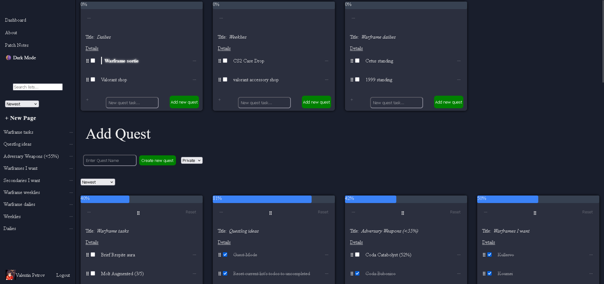
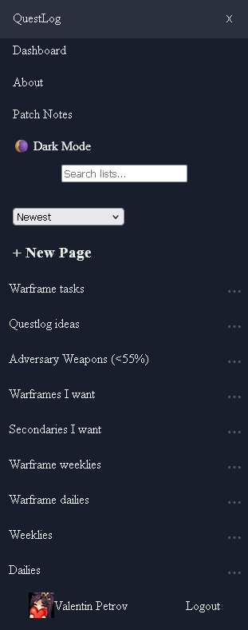
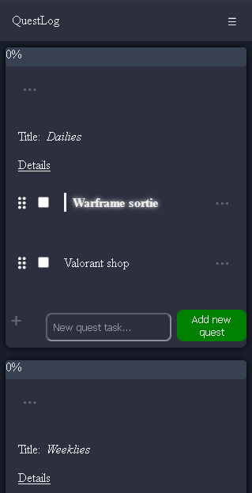

# Questlog

[](https://github.com/valentinpetrov420/questlog/actions/workflows/ci.yml)

A productivity tool built on a flat node architecture, inspired by Notion. 
Any node can be a page or a task, enabling recursive nesting and shareable public links.
Built as a daily-iterated React project with Firebase as the backend.

<!-- hide:start -->
Demo: https://questlog-tan-seven.vercel.app/




<!-- hide:end -->

## Stack

React - TypeScript - Vite - Firebase (Auth + Firestore) - Vitest - ESLint

## Features

- Google OAuth authentication branch with Firebase persistence.
- Guest Mode branch with localStorage persistence. (changing nodes to public/sharing and cross-device persistence require login).
- Full CRUD for nodes (pages and tasks).
- Flat node collection with parentId relationships, hydrated client-side.
- Search and filtering.
- Sidebar navigation.
- Network error handling for list creation, edits and deletion.
- Shareable public node URLs, visibility toggle per node.
- Multiple node types beyond todo (heading, separator, others in the future).
- README.md imported into About Page
- Breadcrumb navigation for nested nodes.
- Any task node promotable to a page with its own /:nodeId.
- Ownership gating - actions hidden from non-owners.
- Dark/light theme with persistence.
- Responsive layout for desktop and mobile devices.
- Drag-and-drop reordering for lists and list items.
- Progress bar for quick task progress scanning.
- Unit Tests for utility functions.
- Skeleton loading states replacing plain text loading.
- Reusable input validation system:
    - Empty input validation.
    - Maximum length validation.
- Pin, archive, restore. 
- Pinned lists with automatic next-task highlighting.
- Dynamic list sorting:
    - Recently created.
    - Custom order.
    - Recently updated.
    - Alphabetical
    - Archived
- Route-guarded navigation with auth-aware redirects.
- Dev-only network latency simulation.


- Build-time changelog generated from git commit history.
- CI:
    - typecheck.
    - lint.
    - tests.

<!-- hide:start -->
## How to run it locally

```
git clone https://github.com/valentinpetrov420/questlog.git
cd questlog
npm install
npm run generate:changelog
npm run dev
```

<!-- hide:end -->

# Future ideas

## Reliability & UX

- Expand network error handling to all CRUD operations.
- Simulated network failure in DevPanel (latency exists, failure does not).
- Better offline and reconnection handling.
- Streaks of completed tasks.
- Untouched nodes for a few days prompt a suggestion to break tasks down.

## Architecture

- Firestore offline persistence to reduce refresh traffic.
- Parent node updatedAt propagation when children are mutated.
- Expand tests to more than just utility functions.

## Features

- More node types.
- Guest Mode data to Firebase data migration on login.

## DevPanel

- Simulated network failures.
- Test data generation.